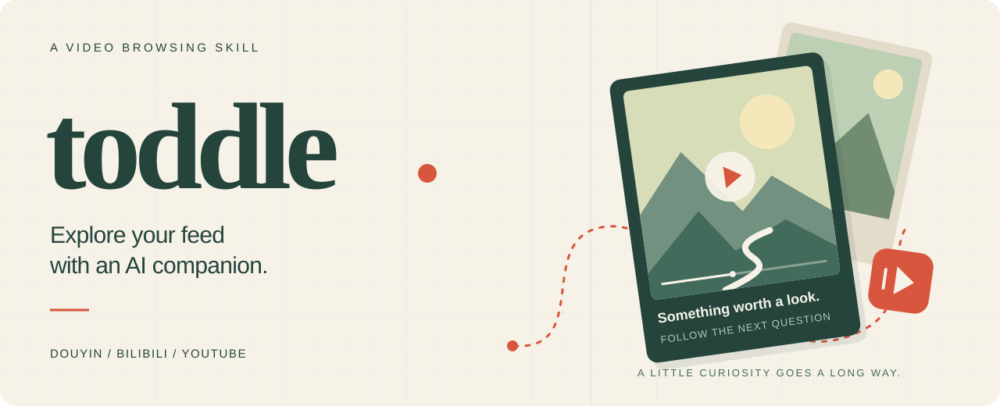

<p align="center">
  
</p>

<p align="center">
  <strong>English</strong> · <a href="README.zh-CN.md">简体中文</a>
</p>

<p align="center">
  <a href="LICENSE"></a>
  <a href="https://www.douyin.com/?recommend=1"></a>
  <a href="https://www.bilibili.com/"></a>
  <a href="https://www.youtube.com/"></a>
</p>

**Let your AI pick something interesting and see where it leads.**

toddle helps your agent browse video feeds the way you would: open Douyin or Bilibili, choose something, watch, and decide what to explore next. It connects video frames with captions or speech, follows questions that come up, and keeps notes that help it get to know your interests. You can also start with a YouTube link, a topic or a local video.

The name means taking small, unsteady steps. Start with one video.

## Start browsing

You need an agent that can control a browser, read pages and view images. **Codex is the tested environment.** Connect its browser and make sure you can access the platform, signing in if needed. toddle provides the skill and media helpers; your environment provides browser access and platform accounts.

**1. Install** with the [skills CLI](https://github.com/vercel-labs/skills), with Node.js and Git available:

```bash
npx skills add ringozzt/toddle-skill -g -a codex
```

<details>
<summary>Install through your agent or clone it manually</summary>

Ask Codex:

```text
Install toddle-skill from https://github.com/ringozzt/toddle-skill
into my global skills directory.
```

Or run this on macOS / Linux:

```bash
mkdir -p "${CODEX_HOME:-$HOME/.codex}/skills"
git clone https://github.com/ringozzt/toddle-skill.git \
  "${CODEX_HOME:-$HOME/.codex}/skills/toddle-skill"
```

On Windows, the default Codex location is `%USERPROFILE%\.codex\skills\toddle-skill`. Check an existing installation before replacing it so you keep local edits. Other agents need equivalent browser, image and file tools; their compatibility has not been verified here.

</details>

**2. Open a new task and give it somewhere to wander:**

```text
Use $toddle-skill to browse my Bilibili homepage.
Pick videos that spark your curiosity, look into them, and follow what you find.
Keep going until I say stop.
```

Your agent starts with the page, actual video images and readable captions. When it needs more evidence, it handles media downloads, frame sampling or transcription. You can begin browsing without first assembling a video toolchain.

> [!NOTE]
> Long sessions can consume substantial model tokens. Set a video count or time limit whenever you want.

## Make it your kind of browsing

| You want to… | Try asking… |
|---|---|
| Browse Douyin | “Use toddle-skill to browse my Douyin feed. Tell me when something catches your attention.” |
| Explore Bilibili | “Pick a few videos from my homepage and follow the questions they raise.” |
| Open a YouTube video | “Watch this with toddle-skill: [video URL]. Show me the moments behind your conclusions.” |
| Find visual ideas | “Look for camera movement and editing ideas. Examine the useful sequences.” |
| Understand your recommendations | “What themes keep appearing in my feed? Keep uncertain guesses separate.” |
| Set a stopping point | “Browse for 10 minutes,” “Look at five videos,” or “Stop here and save the notes.” |

Without a limit, the agent keeps browsing in the current task until you stop it or the environment cannot continue. It saves progress if it reaches a blocker. A request about one video ends with that video's analysis. toddle does not create a background service or scheduled job on its own.

## What happens after the click

**The agent chooses what to explore.** It can follow a recommendation, return to the homepage, skip a weak lead or stay with a question. It shares useful discoveries and its next choice without turning every video into a report.

**It looks for evidence in the video.** Your agent connects timestamps, visible events and language before making a claim. When the browser leaves a gap, it can obtain accessible media, sample frames more closely or transcribe speech. It records how much it examined and reuses existing notes and media when you return.

**You can correct its picture of your interests.** Recommendations, your own actions and your explicit feedback remain separate kinds of evidence. The agent's clicks do not count as your preferences. Your corrections guide later choices through local notes; they do not retrain the underlying model or reveal the platform's internal profile. See the [interest-recording rules](references/interests.md) (Chinese).

## Media tools, when needed

The skill includes three Python helpers. You do not need separate video-analysis or transcription skills.

| Helper | Purpose |
|---|---|
| [`doctor.py`](scripts/doctor.py) | Find reusable Python environments, package versions, FFmpeg and local model candidates. |
| [`sample_frames.py`](scripts/sample_frames.py) | Extract frames at their actual presentation times, with contact sheets and a JSON manifest. Sample a selected interval more densely. |
| [`audio_to_text.py`](scripts/audio_to_text.py) | Produce Markdown, SRT and source-linked JSON with faster-whisper or MLX Whisper. |

The agent uses [yt-dlp](https://github.com/yt-dlp/yt-dlp), [PyAV](https://github.com/PyAV-Org/PyAV), [Pillow](https://github.com/python-pillow/Pillow) and either [faster-whisper](https://github.com/SYSTRAN/faster-whisper) or [MLX Whisper](https://github.com/ml-explore/mlx-examples/tree/main/whisper). It reuses installed tools and cached models, adding missing components as needed. See [media setup and fallback paths](references/deeper.md) (Chinese) for commands and runtime configuration.

<details>
<summary>Do I need to download videos and install models first?</summary>

You can start with browser images and readable captions. Closer inspection may require downloading a video or audio track. Speech without usable captions needs transcription; local Whisper is the included fallback. The agent reserves this work for selected content rather than downloading every homepage card.

The helpers need Python 3.10+ and their relevant packages. MLX Whisper runs on Apple Silicon and needs FFmpeg. A fresh large-v3-turbo model download is about 1.6 GB, so setup time depends on your machine and network. A text-only environment can work with supplied links or local media through available tools, but cannot operate a homepage feed without browser control.

</details>

## Your notes and your controls

The default data directory is `${XDG_DATA_HOME:-~/.local/share}/toddle-skill/`:

```text
history.jsonl   Viewing history, sources, coverage and observations
interests.json  Interest hypotheses, evidence and corrections
runtime.json    Optional paths to your local Python environments and models
```

Keep models, downloaded media and private notes outside this repository. This project does not automatically publish those files. Page text, images and transcripts used for analysis enter your AI provider's context and follow that product's data settings.

Browsing does not automatically like, tip, follow, comment, message or share with friends. On Douyin, “Copy link” in the share panel is used to record a source. Downloads depend on the video, login state, region and tool version.

Frame sampling shows only the sampled moments. Speech recognition can mishear words or invent text; unreliable output is excluded from conclusions. Music, voice quality, sound effects and rhythm require supported audio input. Interest notes describe content preferences, not sensitive identity, personality or health diagnoses.

## Inside the repository

```text
SKILL.md             Instructions your agent follows
agents/openai.yaml   Codex display metadata
scripts/             Environment checks, frame sampling and transcription
references/          Media setup and interest-recording guidance
tests/               Environment-discovery tests
assets/              README artwork
```

Development checks on Apple Silicon covered Bilibili media, two Douyin short links, existing YouTube subtitles, timestamped transcription and frame sampling, including variable frame rates, final-frame coverage and overwrite protection. These are sample checks, not coverage of every platform state or operating system.

To run the environment-discovery tests without downloading models:

```bash
python3 -m unittest discover -s tests -v
```

Contributions are welcome through [issues](https://github.com/ringozzt/toddle-skill/issues) and pull requests. Include tool versions, a redacted error and a public input you have permission to share. Keep cookies, private viewing history, profiles and unapproved media out of reports. Match verification to the change; unchanged media tools do not need a fresh full evaluation.

[MIT License](LICENSE). External tools, models and video content retain their own licenses and usage terms.
