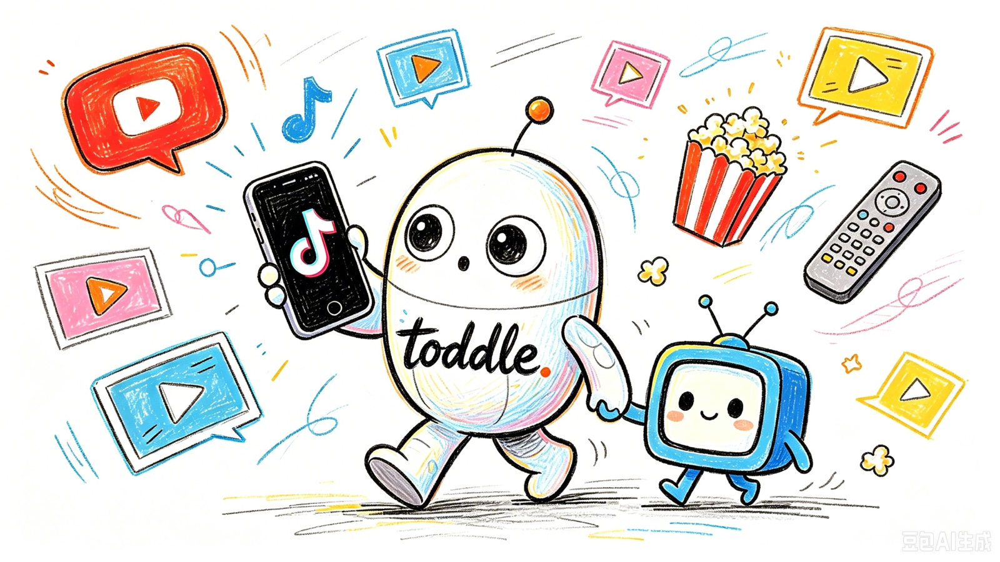

<p align="center">
  
</p>

<p align="center">
  <a href="README.md">English</a> · <strong>简体中文</strong>
</p>

<p align="center">
  <a href="LICENSE"></a>
  <a href="https://www.douyin.com/?recommend=1"></a>
  <a href="https://www.bilibili.com/"></a>
  <a href="https://www.youtube.com/"></a>
</p>

**让 AI 挑一条感兴趣的视频，看看接下来会发现什么。**

toddle 让 Agent 像你一样逛视频流：打开抖音或 B 站，挑一条看进去，再决定下一条。它会把画面与字幕、语音联系起来理解，顺着新问题继续探索，也会留下观看笔记，从推荐内容和你的反馈中积累可修订的近期兴趣画像。你也可以从 YouTube 链接、一个主题或本地视频开始。

toddle 的意思是蹒跚学步。从第一条视频开始。

## 开始刷

**Agent 需要能操作浏览器、查看图片。** toddle 使用已连接的浏览器工具，或通过 Shell 准备获准使用的浏览器 CLI，复用你当前浏览器的登录状态，并尽量在后台浏览，让你继续使用其他 App。接入、授权与后台播放检查见[跨 harness 浏览器接入](references/browser.md)（英文）。

**1. 安装技能。** 本机有 Node.js 和 Git 时，可用 [skills CLI](https://github.com/vercel-labs/skills)：

```bash
npx skills add ringozzt/toddle-skill -g -a codex
```

<details>
<summary>也可以让 Agent 安装，或手动克隆</summary>

直接告诉 Codex：

```text
从 https://github.com/ringozzt/toddle-skill
安装 toddle-skill 到我的全局 skills 目录。
```

或在 macOS / Linux 上运行：

```bash
mkdir -p "${CODEX_HOME:-$HOME/.codex}/skills"
git clone https://github.com/ringozzt/toddle-skill.git \
  "${CODEX_HOME:-$HOME/.codex}/skills/toddle-skill"
```

Windows 默认目录是 `%USERPROFILE%\.codex\skills\toddle-skill`。已有同名目录时先检查旧版本，保留本机修改。目前验证过 Codex 浏览器会话，以及 macOS 上 dsh 通过 Shell 接入浏览器 CLI 的路径。其他 harness 可使用原生工具或 CLI 配合图片读取，具体需要在它的实际权限下验证。

</details>

**2. 新开一个任务，告诉它从哪里逛起：**

```text
用 $toddle-skill 逛我的 B 站首页。
挑你感兴趣的去看看，顺着内容里产生的问题继续找。
我叫停时再结束。
```

AI 先从页面、实际画面和可读字幕开始。视频有口述却没有可用字幕时，它会获取音轨转写，再把口述内容与画面对齐。工具准备由 Agent 处理，让你可以直接开始浏览，无需先研究视频工具链。

不同 harness 完成这套流程所需的步骤和 token 会有差别。优先让它走完整个过程：选视频、看内容、继续浏览并保存有依据的兴趣笔记。环境无法提供获准使用的浏览器连接时，Agent 会说明阻塞；给定链接和本地媒体仍可作为部分替代路径。

> [!NOTE]
> 持续浏览会消耗不少模型 token。你可以随时限定数量、时长，或让它停止。

## 换一种逛法

| 你想做什么 | 可以这样说 |
|---|---|
| 刷抖音 | “用 toddle-skill 刷我的抖音推荐流，看到有意思的告诉我。” |
| 逛 B 站 | “从首页挑几条想看的，顺着里面的问题继续找。” |
| 看 YouTube 视频 | “用 toddle-skill 看这个链接：[视频 URL]。告诉我哪些画面支持你的判断。” |
| 找视觉灵感 | “找一些运镜和剪辑灵感，把有参考价值的段落看细一点。” |
| 梳理近期兴趣 | “我的推荐流里反复出现哪些主题？不确定的判断单独说明。” |
| 控制结束时间 | “刷 10 分钟”“只看 5 条”，或“停在这里，保存笔记。” |

不指定限制时，AI 会在当前任务中持续浏览，直到你叫停或运行环境无法继续；遇到阻塞会保存进度。只要求分析一条链接时，完成该条后交付。toddle 不会自行创建后台服务或定时任务。

## 点进去之后

**AI 会主动选择下一步。** 跟进相关推荐、回首页换一条、跳过收获不大的内容，或者留在一个问题上继续看。它会简短分享有价值的发现和接下来的选择，不必每条视频都交一份长报告。

**判断要能回到视频里。** AI 会联系时间点、画面事件和对应语言。浏览器里的信息不够时，它会主动获取可访问的媒体、密集取帧或转写语音，并记录实际看过的范围。再次遇到同一作品时，优先复用笔记和已有媒体。

**你可以纠正它对兴趣的理解。** 平台推荐、你本人的行为、你的明确反馈，分别作为不同来源的证据；AI 自己的点击不算你的偏好。它通过本地笔记调整后续选片，不会重新训练底层模型，也不声称读取了平台内部画像。具体规则见[兴趣记录](references/interests.md)（英文）。

## 需要细看时，再用媒体工具

随包提供三个 Python 小脚本，不需要额外安装视频分析或转写 skill。

| 脚本 | 用途 |
|---|---|
| [`doctor.py`](scripts/doctor.py) | 分别检查 Python 包、PATH 上的浏览器和媒体 CLI、本地模型，可选写入探测来选择可用的数据目录。 |
| [`sample_frames.py`](scripts/sample_frames.py) | 按真实帧时间取图，生成联系表与 JSON 清单，支持对指定区间密集采样。 |
| [`audio_to_text.py`](scripts/audio_to_text.py) | 用 faster-whisper 或 MLX Whisper 生成 Markdown、SRT 和带来源的 JSON。 |

媒体处理使用 [yt-dlp](https://github.com/yt-dlp/yt-dlp)、[PyAV](https://github.com/PyAV-Org/PyAV)、[Pillow](https://github.com/python-pillow/Pillow)，以及 [faster-whisper](https://github.com/SYSTRAN/faster-whisper) 或 [MLX Whisper](https://github.com/ml-explore/mlx-examples/tree/main/whisper)。AI 优先复用已有环境和缓存模型，缺什么再准备什么。具体命令、运行环境配置与失败时的替代路径见[按需工具说明](references/deeper.md)（英文）。

<details>
<summary>必须先下载视频、安装模型吗？</summary>

浏览器画面和可读字幕足够时，可以直接开始。需要细看时，可能要下载视频或音轨；需要理解口述但没有可用字幕时，就需要转写，本地 Whisper 是随包支持的方式。AI 只对选中的内容增加处理深度，不给每张首页卡片下载整片。

在受限环境中，`audio_to_text.py --cache-root /工作区内的绝对路径` 会把 Hugging Face 与辅助缓存一起放进指定目录；仅设置 `--model-root` 不会重定向所有缓存。参见[沙箱准备说明](references/deeper.md#writable-data-and-cache-directories)（英文）。

媒体脚本需要 Python 3.10+ 及相应依赖。MLX Whisper 运行在 Apple Silicon 上，需要 FFmpeg。large-v3-turbo 首次下载约 1.6 GB，准备时间取决于本机环境与网络。纯文本环境仍可通过可用工具处理给定链接或本地媒体，但没有浏览器控制就无法操作首页推荐流。

</details>

## 记录放哪里，你能控制什么

默认数据目录是 `${XDG_DATA_HOME:-~/.local/share}/toddle-skill/`。只允许写工作区的沙箱中，Agent 可以改用已被 Git 忽略的 `work/toddle-skill/`，告知你一次，并在当前任务中复用。没有可写路径时，笔记保留在对话中，明确说明尚未保存。选定目录中包含：

```text
history.jsonl   观看记录、来源、观察范围和发现
interests.json  兴趣假设、支持证据与纠正
runtime.json    可选的本机 Python 环境和模型路径
```

模型、下载的媒体和私人笔记不进入版本控制。工作区内的私有数据需要处于 Git 忽略且未跟踪的状态；忽略规则不会移除已提交的文件。本项目不会自动发布这些文件。用于分析的页面文字、图片和转写会进入所用 AI 的上下文，数据处理方式取决于对应产品与账户设置。

浏览不会自动点赞、投币、关注、评论、私信或向好友分享。抖音分享面板里的“复制链接”仅用于记录来源。媒体能否下载，取决于具体作品、登录状态、地区和工具版本。

取帧只能说明采样到的时刻。语音识别可能误听或产生幻觉，不可靠的结果不会作为结论依据。配乐、音色、音效和节拍需要受支持的音频输入才能判断。兴趣笔记描述内容偏好，不推断敏感身份，也不作人格或健康诊断。

## 看看代码

```text
SKILL.md             Agent 实际遵循的指令
agents/openai.yaml   Codex 展示信息
scripts/             环境检查、取帧和转写
references/          浏览器接入、媒体准备与兴趣记录说明
tests/               环境、缓存与转写时间戳测试
assets/              README 视觉素材
```

开发时在 Apple Silicon 上验证过 B 站媒体、两条抖音短链、YouTube 既有字幕、带时间戳转写和连续取帧，包括变帧率、末帧覆盖与防覆盖。这些是样本验证，不覆盖每个平台状态或操作系统。

dsh 实测覆盖了 B 站 20 条、抖音 21 条作品，复用用户已登录的 Chrome，在后台采样画面并做本地语音转写。观察范围按采样记录，口述不确定的条目单独标记；浏览器接入与音轨获取均在工作区写入权限下测试。

环境、缓存与转写时间戳测试不需要下载模型：

```bash
python3 -m unittest discover -s tests -v
```

欢迎通过 [Issue](https://github.com/ringozzt/toddle-skill/issues) 或 PR 提交问题和改进，附上工具版本、脱敏错误与允许公开的输入。不要上传 Cookie、私人观看记录、画像或未经允许的媒体。验证范围与改动相称，未改的媒体工具不需要重新做整套评测。

使用 [MIT License](LICENSE)。外部工具、模型和视频内容各自遵循其许可证与使用条件。
